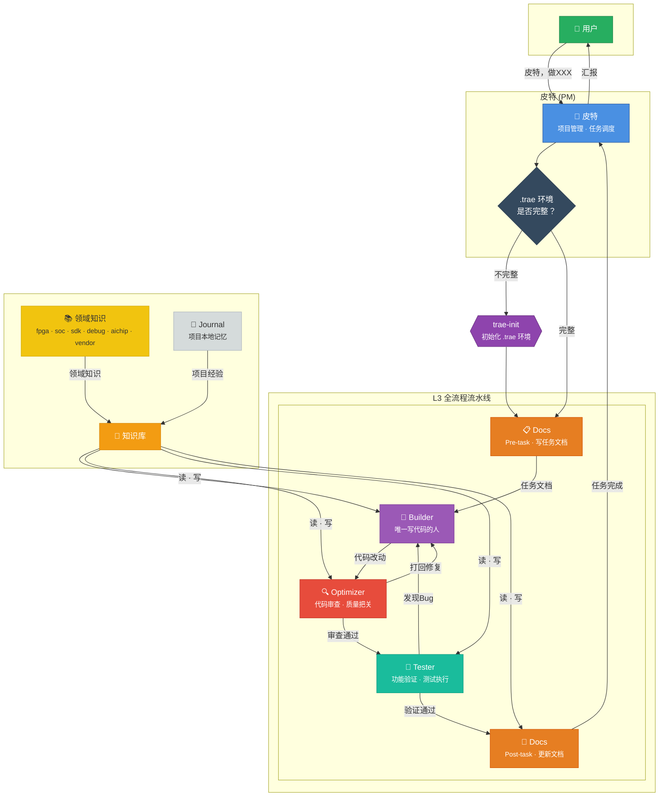

# Trae Toolkit 工作流示意图



## 角色职责速查

| 角色 | 一句话定位 | 核心能力 |
|------|----------|---------|
| 🐻 **皮特** | 项目总负责 | 任务调度 · 流程监督 · 验收汇报 |
| 📋 **Docs** | Pre-task + Post-task | 任务文档撰写 · 文档更新 · 知识归类 |
| 🔧 **Builder** | 唯一写代码的人 | 功能实现 · Bug修复 · 自我记录 |
| 🔍 **Optimizer** | 代码审查专家 | 三大检查（不必要/重复/效率） |
| 🧪 **Tester** | 功能验证 | 验证方案设计 · 真实行为测试 |
| 📚 **领域知识** | 跨项目共享 | overview · patterns · traps |
| 📓 **Journal** | 项目本地记忆 | builder/opt/tester/docs/research/pm |

## 知识流向

```
领域知识库 (全局 ~/.trae/roles-memory/domains/)
       ↓ 读
  各角色 ———→ 项目本地 Journal (项目 .trae/roles/memory/)
       ↓ 写
  通用知识 → 领域知识库（自我迭代）
  项目经验 → Journal（本地积累）
```

## 触发方式

| 触发词 | 匹配角色 | 行为 |
|--------|---------|------|
| 「皮特，做XXX」 | `trae-pm` | 强制走 L3 全流程 |
| 「初始化 .trae」 | `trae-init` | 初始化/补全协作环境 |
| 任意开发需求 | `trae-pm` | 协调各角色执行流水线 |
